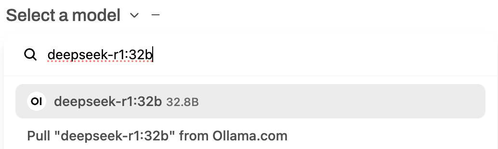
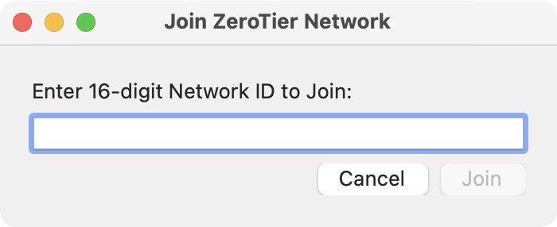
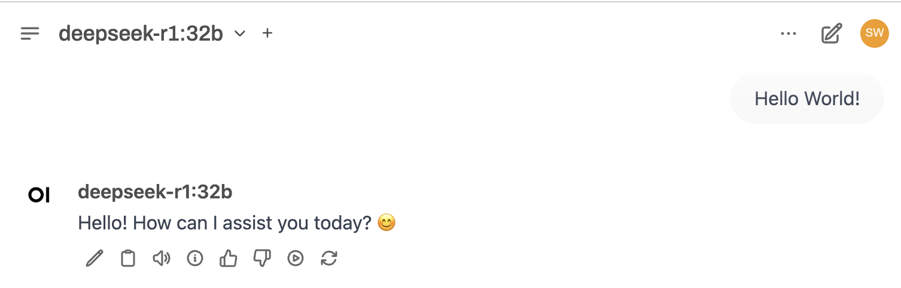

## Introduction

The release of the distilled DeepSeek-R1 model has revolutionized the field. I decided to build one locally, and to my surprise, the process was smoother than I expected. With the knowledge I had, I was able to deploy the model and allow my family to access it through ZeroTier. This tutorial will guide you through setting up a local DeepSeek-R1 model using Open WebUI, ZeroTier, and Docker on Windows with an NVIDIA RTX 3090. (According to my tests, an AMD Ryzen 5900X can also support basic functions, albeit with a response time of several minutes.) By following these steps, you'll be able to run DeepSeek-R1 locally and share it with your family and friends over the network.

Below is a comparison of DeepSeek-R1's performance against other models in different benchmarks, highlighting its strengths in accuracy and efficiency:


With 24GB of memory, DeepSeek-R1:32B can achieve 90% of the performance of ChatGPT-O1. This makes it a powerful yet cost-effective alternative for local deployments, especially for users who need high accuracy but want to run models independently without relying on cloud-based solutions.

## Prerequisites

Before proceeding, ensure you have the following:

- A Windows machine (Windows 10/11 recommended) with an NVIDIA RTX 3090 (You can opt for a smaller model if you have limited GPU memory.)
- Docker installed ([Download Docker](https://www.docker.com/get-started))
- NVIDIA GPU drivers and CUDA installed ([Download CUDA](https://developer.nvidia.com/cuda-downloads))
- Docker CUDA Container ([NVIDIA Docker CUDA](https://hub.docker.com/r/nvidia/cuda))

## Step 1: Install and Configure Open WebUI (1 hour)

Open WebUI is a user-friendly interface for interacting with local LLMs.

1. Run Open WebUI with Docker using GPU support:
   ```sh
   docker run --user=0:0 \
   --env=USE_CUDA_DOCKER=true --env=USE_CUDA_DOCKER_VER=cu121 \
   --env=USE_EMBEDDING_MODEL_DOCKER=sentence-transformers/all-MiniLM-L6-v2 \
   --volume=open-webui:/app/backend/data --network=bridge --workdir=/app/backend \
   -p 3000:8080 --runtime=nvidia -d ghcr.io/open-webui/open-webui:cuda
   ```

### Explanation of Main Parameters

- `--runtime=nvidia`: Enables GPU acceleration for the container, allowing Open WebUI to leverage CUDA for faster performance.
- `-p 3000:8080`: Maps port `8080` inside the container to `3000` on the host machine, allowing access via `http://localhost:3000`.
- `--volume=open-webui:/app/backend/data`: Ensures persistent storage for Open WebUI's data, preventing loss after container restarts.
- `--env=USE_CUDA_DOCKER=true`: Configures the container to use CUDA, enabling GPU acceleration for AI model execution.
- `--env=USE_EMBEDDING_MODEL_DOCKER=sentence-transformers/all-MiniLM-L6-v2`: Specifies the embedding model to be used within the container.
- `--network=bridge`: Sets the container to use a bridge network mode, allowing it to communicate with other services inside the same Docker network.
- `-d`: Runs the container in detached mode, so it continues running in the background.

> **Note:** The `--hostname` parameter is optional and generally not required unless you need to set a specific hostname inside the container.

## Step 2: Configure Open WebUI and Download the Model (1 hour)

1. Open your browser and access Open WebUI at [http://localhost:3000](http://localhost:3000).
2. Create and configure your login credentials.
3. Pull the DeepSeek-R1:32B model within Open WebUI.

4. Test the model locally and monitor your CPU/GPU usage to ensure optimal performance.

## Step 3: Enable Remote Access with ZeroTier (40 minutes)

ZeroTier enables secure remote access to your local setup, allowing your family and friends to connect. The free version supports up to 50 connected devices, making it ideal for personal and small-scale use.

1. Download and install ZeroTier from [ZeroTier’s website](https://www.zerotier.com/).
2. Create a ZeroTier account and set up a new network.
3. Join the network from your Windows machine:
   ```sh
   zerotier-cli join <network_id>
   ```
   Or, use the ZeroTier GUI to join the network, for both WebUI server and user computer. You need to repeat this every time having a new user device. (Mac, Windows, Pad, Phone...)
   
4. Authorize your device in the ZeroTier web console.
5. Retrieve your virtual IP address for remote access and share it with trusted users.
6. Configure managed routes to properly map the ports through ZeroTier for external access.

## Step 4: Configure Windows Firewall for External Access (20 minutes)

To allow external access, configure the Windows firewall:

1. Open Windows Defender Firewall.
2. Navigate to **Advanced Settings** > **Inbound Rules**.
3. Create a new rule to allow inbound traffic on the required port (e.g., 3000).
4. Apply the rule and restart the system if needed.

## Step 5: Enjoy Your Local LLM Server (30 minutes)

With Open WebUI set up and ZeroTier configured, your local LLM model is now accessible over the network. Access the server using your ZeroTier-assigned IP and the configured port:

```
http://<zerotier_ip>:3000
```

Share this link with trusted users to allow them access to your local LLM without exposing it to the public internet. Add them as new users if needed.


## Troubleshooting and Optimization

### Common Issues

- **Docker not starting**: Ensure virtualization is enabled in BIOS.
- **ZeroTier not connecting**: Check firewall settings and authorize the device.
- **Slow performance**: Ensure CUDA is correctly installed and the GPU is being utilized.

### Performance Tuning

- Allocate more resources to Docker if needed.
- Use a dedicated GPU like the RTX 3090 for faster inference.

## Conclusion

You now have a fully functional local DeepSeek-R1 setup with Open WebUI, ZeroTier, and Docker on Windows. You can interact with the model via Open WebUI and even share it with your family and friends over the network using ZeroTier.

For further improvements, consider integrating additional plugins or experimenting with different model configurations. Happy coding!

