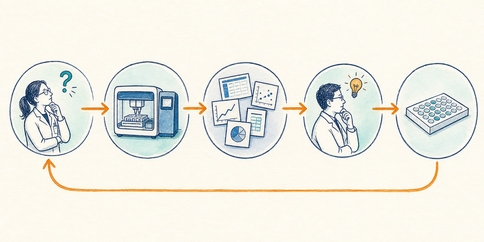

Orchestration, lab informatics systems such as LIMS and ELNs, liquid handlers, and robotic arms are hot topics in lab automation. Recent examples include [Coscientist](https://doi.org/10.1038/s41586-023-06792-0), which connected a large language model with laboratory tools, and [A-Lab](https://doi.org/10.1038/s41586-023-06734-w), which connected machine learning, robotics, and material characterization. OpenAI and Ginkgo Bioworks also recently used GPT-5 with a cloud lab to run closed-loop experiments for [cell-free protein synthesis](https://openai.com/index/gpt-5-lowers-protein-synthesis-cost/).

These systems can automate experiments and speed up the testing and validation of ideas. However, they can also be expensive and time-consuming to build. Today, they are often better at replacing repeated operations than replacing the daily scientific decisions made by scientists. Even in the OpenAI and Ginkgo study, human oversight was still needed for protocol improvements and reagent handling.

## What is the last mile in the lab?

There are also bottlenecks where a small investment can save a lot of valuable scientists' time, but a general solution may not fit. These projects may not support a new business by themselves. They often need highly specific optimization and close collaboration with scientists. I call this the last mile in lab automation: the small but essential steps between a working tool and an end-to-end scientific workflow.

For example, identifying the structures of impurities or drug metabolites often requires evidence from LC-MS, MS/MS, NMR, and other experiments. MS alone may not identify the exact position of a modification or distinguish isomers, so scientists need to cross-check different data and do a large amount of manual annotation ([Prakash et al., 2007](https://pubmed.ncbi.nlm.nih.gov/17405144/)).

Another example is choosing liquid chromatography methods for purification. This can require method screening, analytical runs, and then preparative runs. Each round needs decisions and setup and can use a lot of samples, solvents, and other consumables. Published workflows also describe screening analytical conditions before scaling promising methods to preparative purification ([Font et al., 2011](https://pubmed.ncbi.nlm.nih.gov/21122868/)). What if we can automate some of these experience- and knowledge-based decisions?

## Why the last mile remains manual

These last-mile tasks often remain manual because the work is spread across different instruments, file formats, and software. The person who understands the scientific question may not own the instruments or the data systems. The workflow may also change from one project to another and still needs validation.

In the structure annotation example, evidence from different instruments needs to be connected before a scientist can make a decision. In the chromatography example, results from one screening run affect the setup of the next run. The difficult part is not always running the instrument. It is connecting the data, decisions, and next actions.

*The last mile connects the scientific need, laboratory work, data, decisions, and the next experiment.*

## Find the real bottleneck

Finding the real bottleneck is why we automate the last mile. We are here to help scientists reduce the problems that take the most time and effort, not to force a top-down automation plan across the whole lab. This also gives us the advantage of working closely with scientists, understanding their real needs, and getting them fully involved in the project.

## Learnings

Through my work, I have had the advantage of working closely with scientists from different parts of the drug discovery life cycle and with very different backgrounds. These are the lessons that I found general enough across projects.

### You need to win the trust

We are in a new period of automation, and no one has all the answers. The old methods are already validated, robust, and familiar to scientists. We need to get scientists on board by winning their trust.

We should start small and always provide verifiable results. This does not mean that we cannot talk about the big picture, but we should plan in phases. When we reach each milestone, we gain more trust and move closer to the big picture. Do not think that starting small is a waste of talent. During this process, we can build the infrastructure, identify barriers, and change direction more easily. We can also show what we are capable of and where the limits of automation are. This will help with future collaborations.

### Get a prototype as soon as possible

You and your collaborators may come from very different backgrounds. Sometimes, after a long discussion, both sides still understand the problem differently. It can feel like you are talking past each other. In this case, an early prototype can help communication.

1. Scientists may not be fully clear about what they need. A hands-on demo can help them clarify the request.
2. They will have a better understanding of the complexity.
3. A quick prototype can prevent you from building too much before collaborators ask to start over.

This is a bitter lesson I have learned more than once.

### Save as much useful data as possible

As a machine learning scientist working in lab automation, one of my most common and time-consuming problems is data. Why do we not collect data intentionally while building new tools?

A mass spectrometry database built for spectral matching can also save method information and retention times, even if they are not needed at first. These data may later support retention time prediction, while the method information can help define how transferable a model is.

We should also help guide data collection and point out missing data that may be useful later. For example, if a model shows that changes in the environment over time are more important than a few separate readings, we can start collecting more time points for cell culture.

### Separate models from complex tasks

I will discuss this more in another article. Briefly, we should build the system in modules and define the scope of the current model. What are its inputs and outputs? How does it fit into future steps? Saying no to a request because it is outside the current scope can make the discussion much easier.

### Leave extendable plugins for the future

Based on the last lesson, we should also think about future extensions. This includes plugin design, database schemas, model transferability, and new modalities. For example, a workflow built for small molecules may reuse the same pipelines and experiment setup for peptides while changing the machine learning model in the backend.

## Closing thoughts

The last mile may not look as exciting as a fully automated lab. However, these small and highly specific improvements can remove real bottlenecks from scientists' daily work. Large companies and startups may first capture the low-hanging fruit and the most profitable parts of lab automation. The real challenge of last-mile automation starts after that. These problems are highly specific to each organization and depend heavily on internal collaboration and development. This is why the practical approach described above matters: start from scientists' needs, keep the big picture in mind, and move toward it in small steps. Small results help build trust, prototypes help us learn, and useful data supports the next steps.
