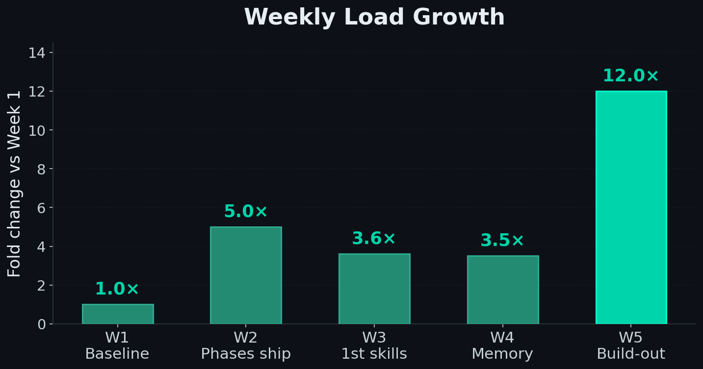
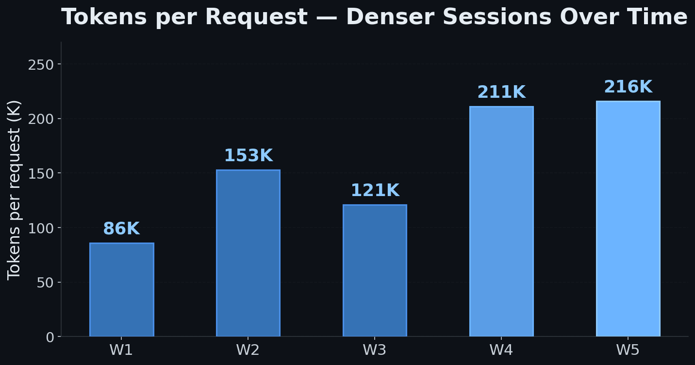
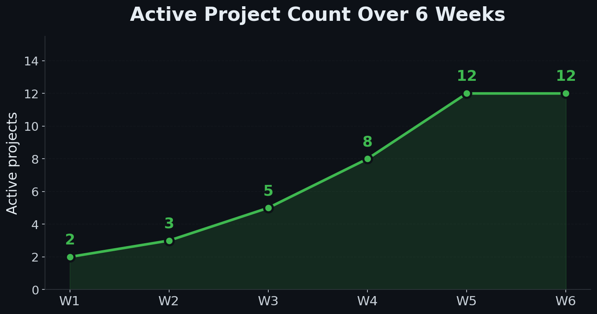

> *Six weeks of token usage, in numbers.*
> *I'm a slow adopter. This is what catching up looks like.*

---

## Where I started

I'm a computational chemist at a pharma. I write code, but I'm slow to pick up new tools. This time I want that to change.

The timeline:

- **GPT era (late 2022 – mid 2023):** I thought it was an ads event. Overpresented, underdelivering.
- **Mid 2023:** Tried coding with it. Copy-paste from chat to IDE, paste back, ran it. Treated it like a slightly faster Stack Overflow.
- **Mid 2024 – early 2025:** Started using LLMs for information search instead of Google. The switch was about a year behind when I should have made it.
- **Through 2025:** Started reviewing what it wrote, line by line. Caught some things, missed others. Trust grew slowly.
- **Spring 2026 (now):** Letting an agent take over most of the code-writing for a dozen active projects. Reviewing diffs, not lines. Weekly load grew about 12× in five weeks.

This essay is what a slow adopter looks like when the thing finally clicks.

---

## Why I care about token usage

It is obviously wrong to optimize for maximum tokens, but as a beginner I realized token use is a decent proxy for how familiar I am with the tool.

More tokens per task usually means fewer back-and-forth turns, more self-evaluation, and more iteration. It pushed me to think about better harnessing and how to interact with the agent like a code reviewer.

Through this journey, I learned how to set up tools, skills, and memories.

---

## What the numbers say

Weekly volume, normalized to week 1 (laptop + cluster combined):

The eye goes to the spike on the right — week 5 was about **12× week 1**. But the more interesting number is hidden in weeks 3 and 4: load stayed level *while requests dropped* (3,167 → 1,719). I wasn't running more turns. I was running heavier ones.

86K → 216K is a **2.5× fold change** in payload per call. Output tokens per call grew 1.5× over the same window (512 → 778). Much denser sessions.

What's more, I slowly moved all work from my laptop to the cluster — long-running sessions under tmux or Zellij, with a sandbox where the agent could run autonomously without me re-approving every command.

---

## Six weeks, six unlocks

**W1** — 186M tokens · 2,164 requests

First cluster sessions. First three skill templates landed: experiment runs, cluster submission, PR descriptions. Earliest memory rules: file scope (don't touch other users' code), review-figures-before-commit. The unlock was vocabulary — naming the rules the agent would follow.

**W2** — 544M tokens · 3,551 requests

First two project repos shipped. No new infrastructure — pure use of W1 scaffolding. 3× the token volume of W1; the unlock was just committing to real projects.

**W3** — 382M tokens · 3,167 requests

"No login-node abuse" memory written after a long BFS scan slowed the host. Slurm cluster reference memory added.

**W4** — 362M tokens · 1,719 requests

Heavy iteration on existing projects. Set up repos and READMEs so projects could reference each other.

**W5** — 1,762M tokens · 8,168 requests

Six new project repos shipped first commits in five days. First skill promotions — a job-resume skill and a figure-review skill, both graduated from feedback memories that kept firing. First three hooks landed: a Stop-event lint, a Stop-event commit-recommend, and a PreToolUse pre-commit hook that blocks `git commit` when the staged diff touches numerical logic until the math is articulated in the message body. Multiagent workloads also drove the usage spike. The unlock was compounding — projects, skills, and hooks all landed the same week because the spine made each one cheap.

**W6** — 1,094M tokens · 5,063 requests

Tightening week. Two new PreToolUse hooks finally landed: a Slurm-submission validator and a login-node-abuse blocker (promoted from the W3 memory to a skill). Four new diagnostic skills — status dashboards across projects, cluster shortcuts. Eleven new memory rules, most of them workflow tightenings after I ran the built-in `/insights` command.

Each week added something the next week built on. None of it was strategic — each piece came from a specific friction in the prior week that I got tired of.

---

## What changed

In the order I learned them. Not all stuck the first time.

### 1. Build infrastructure before features

Weeks 1–2 were 80% project work. By week 5 it was the inverse — and that's when output went up. Hooks, memories, skills, scaffolding compound. New projects start at week-5 productivity.

### 2. Solve permissions once

Every "do you want to run this?" is friction. The project's permissions config ended up with **91 shell allowlist entries** and **17 file-access entries**. Plus a deny list covering 8 sibling user directories so I can't edit colleagues' code by accident. Most operations now run without a prompt. Sandbox or running in a container is a better option, but both are limited by available resources.

### 3. Solve the boring plumbing

Set up the cluster submission path so a sandboxed compute environment could submit jobs without a shared filesystem. Remote VS Code pointed at GPU nodes. Job logs streamed back to my laptop without manual `rsync`. Each one removes ~5 minutes of friction × dozens of times per day.

### 4. Ask the agent to ask me questions

> *"Ask me three clarifying questions before you start."*

Highest-impact line I added to my prompts. Half the time the questions made me realize I didn't know what I wanted.

### 5. Plan before execute

Plan mode. Reviewable artifact before any code is written. Saves the revert-and-retry cycle.

### 6. Write memories with reasoning, not just rules

Every memory file has a `Why:` line and a `How to apply:` line. The agent learns the rule's *boundary*, not just the rule. Memories that say "do X" without saying why decay; memories that say "do X *because* Y last quarter" survive.

### 7. Promote memories to skills when they keep firing

A "resume the partial job, don't re-run from scratch" memory became a `/resume-job` invocable skill after the same procedure ran three times. Memory layer compounds *through promotion* — not just by accumulation.

### 8. Let projects talk

One project consumes utility tools written in another. A third will feed its outputs back as priors into the first. The portfolio isn't 12 independent projects — it's a graph. Each project's outputs become another's inputs.

### 9. Multiagent for parallel branches

Background subagents for independent tasks (search this repo / draft this analysis / find this dataset). Subagent context shields the main session from large outputs. Three branches in flight without context contamination.

---

## Unexpected side effects

- **Negative results published in the repo.** A full fine-tune on a published embedding model lost to a simpler baseline. Logged as `Exp X.YZ NEGATIVE`, linked from the project's manuscript. Failed runs that get *committed* become next quarter's prior, not buried compute.

- **Pre-commit quality gates.** A hook that blocks `git commit` when staged changes touch numerical logic, until I articulate the math in the commit body. Came after I caught the agent producing markdown with *estimated* numbers that the actual data later contradicted by 50–100% per day. Wrong numbers don't fail tests; they just ship. Now they fail commits instead.

- **Tracking my own learning.** This essay exists. Tracking it makes the meta-improvements visible — like load-per-call rising while request count fell. Only see it if you look.

---

## Infrastructure inventory

*As of May 2026:*

- **25 memory files** — autonomous-mode rules, cluster-resource defaults, scoring-API references
- **6 skills** — domain-specific reasoning, cluster-submit, experiment-run, figure-review, resume-job, PR-description
- **3 hooks** — numerical-review gate, cluster-job-ID capture, ruff lint
- **119 permission entries** — 91 shell allowlist, 17 file-access, 11 deny rules (maybe there are smarter ways?)
- **36 documented patterns** — from "Agent vs Pipeline" (#1) to "Memory→skill promotion" (#36)

The portfolio plateaued at 12 once the infrastructure stopped being the bottleneck. Growth now is depth-per-project — one of the agents going Phase 1 → 6b in three days is what depth growth looks like when the spine is in place.

---

## Analogies from chemistry

**Reaction rate isn't throughput.** More turns per hour doesn't help if half are clarifying questions. Spec quality is the rate-limiting step. So I ask the agent to ask me questions instead of letting it guess.

**Catalysts beat reagents.** A small piece of well-placed infrastructure accelerates everything downstream. A hook that blocks numerical commits costs nothing and prevents an entire failure mode.

---

## For a chemist starting today

1. One project. One `CLAUDE.md`. One `AGENTS.md`. Don't scaffold for 12 on day one.
2. Wait until you've corrected the agent on the same thing three times before writing the first memory. Earlier than that and the rules don't generalize.
3. Solve permissions early. Twenty allowlist entries on week one removes hundreds of prompts on week three.
4. Tell the agent to ask you clarifying questions when you're vague.
5. Plan before execute.
6. Track your weekly load. Mine grew 12× in five weeks; without a routine pull on usage telemetry I wouldn't have noticed.

---

## What's next

Now I can easily use up my weekly quota, so I need to think about token efficiency. 

The thing that gets faster isn't the adoption itself. It's the time between *seeing other people do it* and *deciding to actually try it*.
